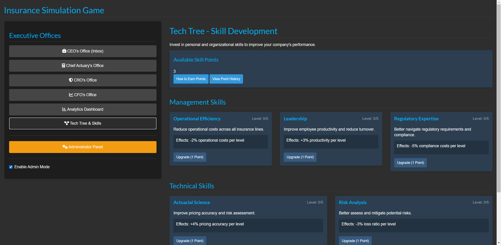

# Implement Skill Point Award Events

## Description
This pull request implements a comprehensive system for skill point award events in the Insurance Simulation Game. Players now earn skill points through various achievements and random events, making the progression system more dynamic and engaging. The implementation includes event generation, processing, inbox notifications, and UI enhancements.

Resolves #12 (Implement Skill Point Award Events)

## Features Added
- Automatic skill point awards based on player achievements (financial performance, innovation, etc.)
- Random skill point events that can occur during gameplay
- Highlighted inbox messages for achievement notifications with appropriate sender attribution
- Direct navigation from notifications to the Tech Tree for skill allocation
- Enhanced testing functionality for simulating events in admin mode

## Screenshots

## Changes Made
- Added event generation and processing functions to `backend/simulation.R`
- Enhanced the inbox system in `app.R` to display and handle skill point event messages
- Updated `tech_tree_module.R` to integrate with the event system
- Added special styling for skill point messages in `www/custom.css`
- Updated test scripts to verify all aspects of the skill point event system

## How to Test
1. Run the application with `shiny::runApp()`
2. Create a profile and enable admin mode
3. Navigate to the Tech Tree
4. Use the test buttons to simulate different types of skill point events
5. Check the inbox for notifications and verify points are awarded
6. Verify the point history displays correctly in the Tech Tree section

## Additional Notes
- The system integrates with the existing skill point mechanism in `data_ops.R`
- Events are generated both randomly and based on player performance
- The inbox system now processes skill point events when viewed
- All events are stored persistently and available across game sessions

## Technical Notes
- Implementation includes proper persistence of point history
- Award function can be called from any module using `techTreeData()$awardPoints(points, description)`
- System is designed to be expandable for additional event types

## Future Enhancements
- Add animations/effects when points are awarded
- Create real gameplay conditions that trigger events automatically
- Enhance visualization of skill point impacts
- Add more detailed skill point economy 